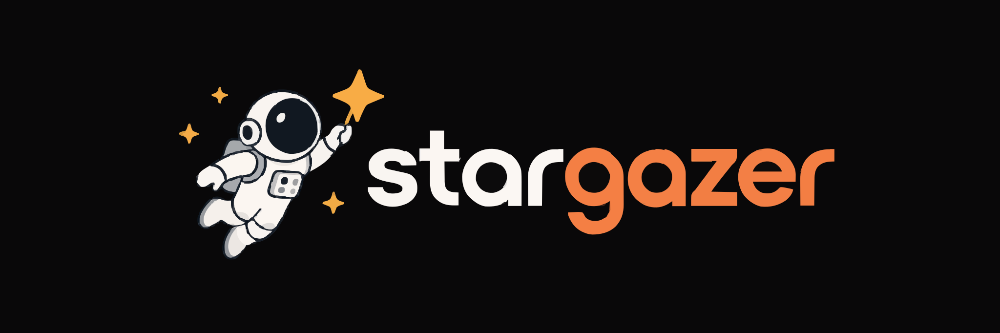

<p align="center">
  
</p>

<p align="center">
  <strong>Open-Source GitHub Stargazer Cards & 60fps MP4 Videos</strong>
</p>

<p align="center">
  
  
  
  
  
  
</p>

---

## Overview

Stargazer turns your GitHub repository's community milestones into high-resolution cards (1600 × 900) and 60fps MP4 videos directly in the browser. 

The application runs entirely client-side with zero backend server dependencies. Community data is fetched directly from the GitHub REST API, animated with Framer Motion, and exported to crystal-clear PNG images or hardware-accelerated MP4 videos.

---

## Features & Design Highlights

* **Pill & Rounded Geometry**: Complete consistency across interactive controls—inputs, segmented tabs, and primary action buttons utilize `rounded-full` pills.
* **4-Layer Animation Pipeline**:
  * **Staggered Entrance**: Framer Motion `<FadeIn>` wraps cards, sections, and headers with subtle offsets and dynamic delays.
  * **Smooth Inertia Scrolling**: Powered by Lenis with continuous RAF loop (`lerp: 0.15`), giving smooth deceleration without blocking native touch scrolling.
  * **Tailwind Keyframes**: High-performance CSS keyframe animations for marquee streams (`marquee-left`, `marquee-right`) and status dot pulses.
  * **Scroll Restoration**: Seamless route and navigation transitions resetting window scroll to `(0, 0)`.
* **Editorial Documentation**: Built-in `/how-to` guide structured after shadcn/ui documentation with a sticky "On This Page" table of contents and live scrollspy.
* **Ephemeral Security**: Zero token caching in `localStorage`. Personal Access Tokens (PAT) remain strictly in ephemeral React memory for the active browser session.

---

## Templates

### 1. Counter Template
A classical layout designed for milestones, repository anniversaries, and release announcements:
* Symmetrical laurel wreath branches flanking the repository title.
* Dynamic counting animation for Stars, Forks, and Days metrics in DM Sans Regular.
* Structured 2-row grid of 16 stargazers with colored ring borders.
* Subtle bottom gradient fade to ground the card composition.

### 2. Ticker Template (Marquee)
An energetic avatar marquee designed for README headers and dynamic feeds:
* Top-left repository hierarchy header (`owner / repo`) with owner avatar.
* Physics-driven horizontal marquee stream with continuous 60fps looping.
* 5-pointed yellow star anchored directly beneath each community avatar.
* Bottom-right live metric counter readout.

### 3. 3D Orbit Template
A spherical carousel with dynamic depth and radial lighting:
* Curved spherical arc trajectory with depth-sorted z-index layering.
* Dynamic scale magnification (0.7x background up to 1.35x foreground).
* Ambient radial glow centered on the focal gravitational point.
* Primary accent ring on active focus member and star metrics.

### 4. Constellation Template
An organic point-cloud cluster designed for contributor appreciation and showcase banners:
* Centered stacked layout: 108px owner mascot avatar, repository title, and live star count.
* Full-field organic scatter of 100 non-overlapping avatars across the entire canvas with natural boundary bleed.
* Soft radial fade vignette backdrop situated directly behind the center content, creating an ethereal cosmic glow while ensuring 100% text and mascot legibility.
* Subtle atmospheric depth blur and opacity gradation across the starfield.

---

## Quick Start

### Prerequisites
* [Bun](https://bun.sh) 1.0+ (or Node.js 20+)

### Run the Studio Locally

```bash
# Clone the repository
git clone https://github.com/CharanMunur/stargazer.git
cd stargazer/client

# Install dependencies
bun install

# Start the local development server
bun dev
```

Open `http://localhost:4321` in your browser.

* Navigate to `/` for the landing page overview and template showcase.
* Navigate to `/how-to` for the step-by-step PAT guide and export walkthrough.
* Navigate to `/generate` to launch the interactive studio (supports deep-linking, e.g. `/generate?generate=ticker`).

---

## Architecture & Export Pipeline

1. **Client-Side Data Fetching**: Stargazer queries GitHub's public API (`https://api.github.com/repos/{owner}/{repo}`) directly from the client. Unauthenticated requests support public repositories; optional Personal Access Tokens (PAT) can be provided to bypass rate limits.
2. **Real-Time 60fps Rendering**: Templates are constructed as pure React components animated via Framer Motion springs, scaled deterministically to a 1600 × 900 virtual canvas.
3. **PNG Image Export**: High-resolution DOM capture executed in milliseconds via the HTML5 Canvas API (`html-to-image`).
4. **MP4 Video Export**: 60fps video encoding executed directly in the browser via WebCodecs `VideoEncoder` and `mp4-muxer` (with standard `MediaRecorder` fallback).

---

## Project Structure

```text
stargazer/
├── AGENTS.md                            # Design rules & architecture guidelines
├── client/                              # Astro + React + Tailwind frontend
│   ├── src/
│   │   ├── components/
│   │   │   ├── CardGenerator.tsx        # Interactive Studio interface
│   │   │   ├── FadeIn.tsx               # Entrance & scroll animation wrapper
│   │   │   ├── GitHubStars.tsx          # Real-time repository star badge
│   │   │   ├── HowToGuide.tsx           # shadcn-style documentation with scrollspy
│   │   │   ├── SmoothScroll.tsx         # Lenis smooth inertia scrolling
│   │   │   ├── TemplatesGallery.tsx     # Homepage template gallery
│   │   │   ├── ThemeToggle.tsx          # Theme switcher with observer protection
│   │   │   ├── templates/               # React + Framer Motion templates
│   │   │   │   ├── ConstellationCard.tsx# Constellation template
│   │   │   │   ├── CounterCard.tsx      # Counter template
│   │   │   │   ├── OrbitCard.tsx        # 3D Orbit template
│   │   │   │   ├── TickerCard.tsx       # Ticker template
│   │   │   │   └── types.ts             # Template TypeScript interfaces
│   │   │   └── ui/                      # Official shadcn/ui components
│   │   ├── data/
│   │   │   └── howToData.ts             # Structured documentation content
│   │   ├── lib/
│   │   │   ├── canvasRenderer.ts        # Canvas rendering engine
│   │   │   ├── templatesData.ts         # Centralized template metadata & specs
│   │   │   └── videoExporter.ts         # In-browser MP4 video exporter
│   │   └── pages/
│   │       ├── generate.astro           # Studio route (/generate)
│   │       ├── how-to.astro             # How to guide route (/how-to)
│   │       └── index.astro              # Landing page (/)
│   └── public/                          # Static assets and DM Sans font files
└── README.md
```

---

## Security & Privacy

* **Zero Server Persistence**: No database, no logging server, and no analytics tracking.
* **In-Memory Token Processing**: GitHub Personal Access Tokens are handled strictly in the user's browser memory and are never saved to `localStorage` or transmitted to external servers.

---

## License

MIT License. See [LICENSE](LICENSE) for details.
